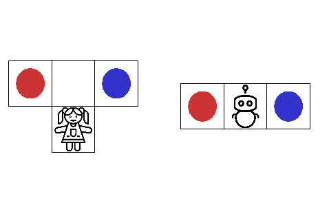

This codebase accompanies the paper "Benefits of Assistance over Reward Learning".

## How to run the code

```
pip install -e .
python -m assistance_games.run
```

You should see the environment below:



## Reproducing results from the paper

Meal choice environment (Section 4.1):

```
# H comes home early
python -m assistance_games.run -e mealchoice -a pbvi
# H comes home late
python -m assistance_games.run -e mealchoice -k feedback_time:3 -a pbvi
```

Wormy apples environment (Section 4.2):
```
# Regular assistance
python -m assistance_games.run -e worms -a pbvi
# Two phase
python -m assistance_games.run -e worms -k two_phase:True -a pbvi
# With a lower discount
python -m assistance_games.run -e worms -a pbvi -k discount:0.9
python -m assistance_games.run -e worms -a pbvi -k two_phase:True,discount:0.9
```

Cake or pie environment (Section 4.3):
```
python -m assistance_games.run -e cake_or_pie -a dqn -nr -o pedagogic_human --seed 0
```
The five seeds used in the paper are 0 through 4.

Running headless: use the ``xvfb-run -a`` command, e.g. for the cake or pie environment
```
xvfb-run -a python -m assistance_games.run -e cake_or_pie -a dqn -nr -o pedagogic_human --seed 0
```

Plotting deep RL training curves: use the ```src/assistance_games/plot_eval_stats.ipynb``` notebook.

## Overview of files:

### core/
Contains files with the core classes, such as:
  * `pomdp.py`: Abstract class for POMDPs, inherits from `gym.Env`
  * `assistance.py`: Defines an overarching abstract classes for assistance problems, as well as subclasses that provide more methods that can be used to achieve speedups
  * `reduction.py`: Implements the reduction from assistance problems to POMDPs, as described in the paper. Multiple versions of the reduction are available, depending on how the resulting POMDP is meant to be used (e.g. do we need transition matrices, or just a method computes the next state given the current state and actions?)
  * `distributions.py`: Defines classes for probability distributions. We rolled our own implementation instead of using an existing one.
### envs/
Contains various implementations of assistance problems and POMDPs.
### rendering.py
Rendering utils for envs.
### solver.py
Implements POMDP solvers that can be used to solve the environments.
  * exact\_vi : Exact solver, can only solve very small environments
  * pbvi : Approximate anytime solver, relatively fast for medium-sized environments
  * deep\_rl\_solve : Simple wrapper around stable\_baselines.PPO2
### parser.py
Parser for .pomdp files (mostly for testing/benchmarking solvers).
### run.py
Simple script to run an environment with a specific solver and evaluate the resulting policy.
### utils.py
Some utils.
### tests.py
Very basic smoke tests.


## Solvers:

If running PBVI on your task gives different results each time, you might want to increase the number of iterations to make sure it finds the optimal solution. Some of the environments are sensitive to this.

## Efficiency gains

Normally, in POMDPs, we use probabilities O(o | s) of observations. However, for assistance problems, we are often dealing with a very particular type of POMDP, in which our original state space is fully observable and deterministic, with the only uncertainty being the reward; and since all the information about the reward is contained in the human's actions, we can instead treat just the human's actions as observations. This change is implemented in `reduction.py` and will be automatically selected for you if you use `run.py` and pass the appropriate `fully_observable` and `deterministic` flags during environment creation (as is done in our environments). This greatly reduces the complexity of the exact solver and PBVI. For example, in RedBlue, it reduces an exponent in the complexity from 24 to 2, changing it from intractable to solvable in seconds.